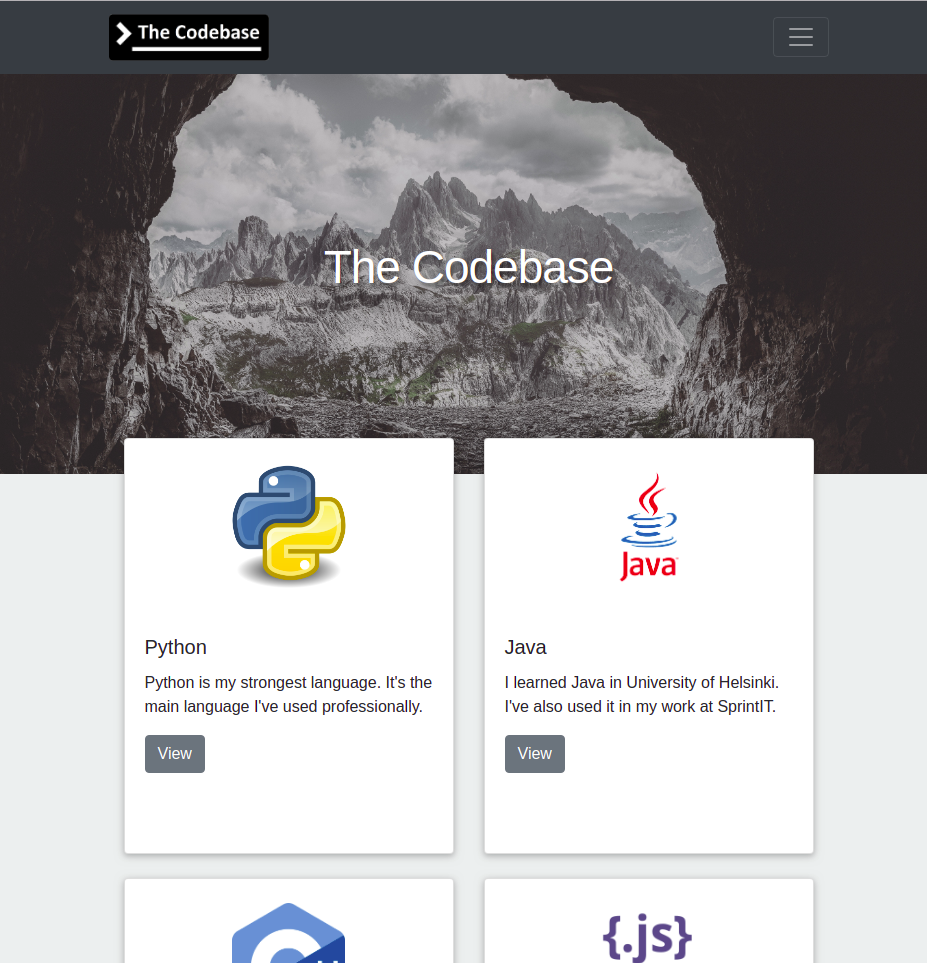

# The Codebase

[www.thecodebase.site](http://www.thecodebase.site "www.thecodebase.site")

Install instructions:

* `sudo apt-get install mysql-client mysql-server libmysqlclient-dev -y`
* `git clone <this repo>`
* `cd thecodebase`
* `pip install -e .`
